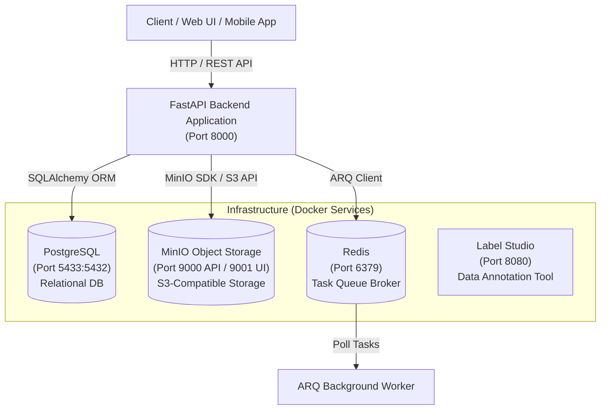

# 🚀 AI Ecosystem Workspace — Multi-Service Core Infrastructure

**ai-ecosystem-workspace** คือโปรเจกต์ต้นแบบสถาปัตยกรรมระบบสำหรับงานด้าน AI/ML ที่ออกแบบในรูปแบบ **Modular Monolith Backend with Containerized Infrastructure** สำหรับเป็นฐานการพัฒนาแอปพลิเคชันและการศึกษาการตั้งโครงสร้างโปรเจกต์ระดับองค์กร

---

## 🏗️ สถาปัตยกรรมระบบ (System Architecture)



---

## 📦 บริการหลักในโครงสร้าง (Infrastructure Services)

บริการทั้งหมดถูกจัดเตรียมไว้ในรูปแบบ Docker Container ผ่านไฟล์ `compose.yml`:

| บริการ (Service) | Container Name | Ports (Host:Container) | หน้าที่และการทำงาน (Role & Responsibilities) |
| :--- | :--- | :--- | :--- |
| **PostgreSQL** | `my_postgres` | `5433:5432` | ฐานข้อมูลเชิงสัมพันธ์สำหรับเก็บข้อมูลผู้ใช้ (`users`), Metadata และสิทธิ์การใช้งาน |
| **MinIO** | `my_minio` | `9000:9000` (API)<br>`9001:9001` (UI Console) | Cloud Object Storage (S3 Compatible) สำหรับเก็บรูปภาพโปรไฟล์ และไฟล์สื่อดิบ |
| **Redis** | `my_redis` | `6379:6379` | In-Memory Cache และ Message Broker สำหรับระบบคิวงานประมวลผลเบื้องหลัง (ARQ) |
| **Label Studio** | `my_label_studio` | `8080:8080` | แพลตฟอร์มการติดฉลากข้อมูล (Data Annotation) สำหรับเตรียม Dataset ฝึกฝน AI/ML |

---

## ⚡ เริ่มต้นใช้งาน (Quick Start Guide)

### 1. เริ่มต้นรันบริการด้านโครงสร้างพื้นฐาน (Start Docker Services)
```bash
docker compose up -d
```

### 2. ติดตั้งและเริ่มเซิร์ฟเวอร์ Backend (Start FastAPI Backend)
```bash
cd backend
uv sync
uv run uvicorn main:app --reload --host 0.0.0.0 --port 8000
```

### 3. หน้าเอกสาร API Documentation
- **Swagger UI**: [http://localhost:8000/docs](http://localhost:8000/docs)
- **ReDoc UI**: [http://localhost:8000/redoc](http://localhost:8000/redoc)
- **MinIO Console**: [http://localhost:9001](http://localhost:9001) (User: `miniouser`, Password: `miniopassword`)
- **Label Studio UI**: [http://localhost:8080](http://localhost:8080)

---

## 📂 ดัชนีเอกสารกำกับแต่ละส่วนของระบบ (Directory Documentation Index)

- 📘 [**`backend/README.md`**](backend/README.md): เอกสารภาพรวมของระบบ Backend การจัดตั้งโปรเจกต์ด้วย `uv` และคำสั่งรัน Snapshot API
- 📗 [**`backend/core/README.md`**](backend/core/README.md): เอกสารอธิบายส่วนประกอบ Shared Core (Config, DB Engine, MinIO Client, Logger)
- 📙 [**`backend/app/features/README.md`**](backend/app/features/README.md): เอกสารอธิบายสถาปัตยกรรมแบบ Feature-Based Slice (Auth, Profile, Storage, System, Tasks, Annotation)
- 📕 [**`backend/sandbox/README.md`**](backend/sandbox/README.md): เอกสารอธิบายสคริปต์ทดสอบการเชื่อมต่อแต่ละ Component (Integration Tests)
- 📐 [**`diagram/README.md`**](diagram/README.md): เอกสารอธิบายไดอะแกรมสถาปัตยกรรมระบบ (Draw.io Diagrams)
