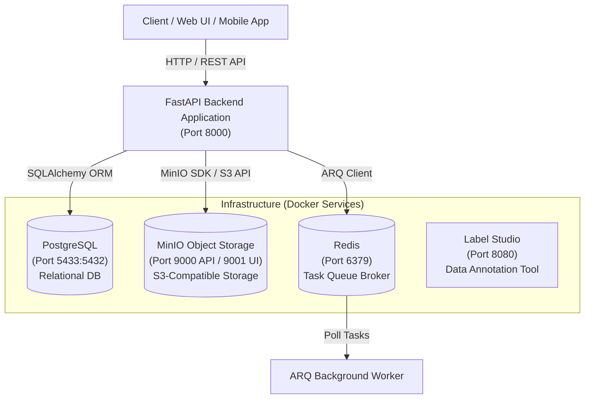

# รายงานการศึกษาและวิเคราะห์สถาปัตยกรรมโปรเจกต์ (AI Ecosystem Architecture Report)

รายงานฉบับนี้จัดทำขึ้นจากการวิเคราะห์โครงสร้างและซอร์สโค้ดของโปรเจกต์ **`ai-ecosystem-workspace`** เพื่อสรุปรูปแบบ สถาปัตยกรรม แนวคิดการออกแบบ และหน้าที่ของแต่ละส่วนประกอบ สำหรับใช้อ้างอิง ถอดบทเรียน และนำไปประยุกต์สร้างใน Repository ของตนเอง

---

## 1. ภาพรวมสถาปัตยกรรมระบบ (System Architecture Overview)

โปรเจกต์นี้เลือกใช้สถาปัตยกรรมแบบ **Modular Monolith Backend with Containerized Infrastructure** โดยแยกส่วนการประมวลผลหลักออกเป็น **FastAPI Backend** และจัดการบริการพื้นฐาน (Infrastructure Services) ทั้งหมดผ่าน **Docker Compose**



---

## 2. หน้าที่และการทำงานของแต่ละส่วนใน Docker Compose (`compose.yml`)

ในไฟล์ `compose.yml` มีการแบ่ง Service ออกเป็น 4 ส่วนหลัก ซึ่งทำหน้าที่สนับสนุนการทำงานในแต่ละด้านดังนี้:

| บริการ (Service) | พอร์ต (Ports) | ภาพรวมหน้าที่และการทำงาน (Role & Function) |
| :--- | :--- | :--- |
| **1. PostgreSQL** | `5433:5432` | **ระบบฐานข้อมูลหลัก (Relational Database)**<br>- ใช้เก็บข้อมูลที่มีโครงสร้าง เช่น ข้อมูลบัญชีผู้ใช้ (`users`), รหัสผ่านที่เข้ารหัส (`hashed_password`), สิทธิ์การใช้งาน และ Metadata ของไฟล์โปรไฟล์<br>- มีการเชื่อมต่อไปยัง Label Studio เพื่อใช้เก็บ Metadata การ Annotation |
| **2. MinIO** | `9000:9000` (API)<br>`9001:9001` (UI Console) | **ระบบจัดเก็บไฟล์วัตถุ (Cloud Object Storage - S3 Compatible)**<br>- ใช้เก็บไฟล์ดิบและไฟล์มัลติมีเดีย เช่น รูปภาพโปรไฟล์ (`avatars`) หรือไฟล์ชุดข้อมูล (Dataset)<br>- ทำงานร่วมกับ FastAPI ในการสร้าง **Presigned URL** เพื่อให้ Client สามารถดาวน์โหลดรูปภาพได้โดยไม่ต้องผ่าน Server โดยตรง |
| **3. Redis** | `6379:6379` | **In-Memory Data Structure Store & Message Broker**<br>- ใช้เป็น Broker รับส่งข้อความสำหรับคิวงานพื้นหลัง (Async Task Queue) ร่วมกับ **ARQ**<br>- ช่วยแยกงานที่ใช้เวลานาน (เช่น การประมวลผลรูปภาพ หรือการส่ง Notification) ไม่ให้ส่งผลกระทบต่อความเร็วของ API |
| **4. Label Studio** | `8080:8080` | **แพลตฟอร์มการติดฉลากข้อมูล (Data Annotation & Labeling Platform)**<br>- เครื่องมือสำหรับมนุษย์หรือ AI ในการกำหนดคำอธิบายภาพ (Bounding Box, Classification, Segmentation) เพื่อเตรียมข้อมูลสำหรับเทรนโมเดล AI |

---

## 3. โครงสร้างซอร์สโค้ดและการทำงานฝั่ง Backend (`backend/`)

โครงสร้างโฟลเดอร์ฝั่ง Backend ออกแบบตามหลัก **Feature-Based Slice Architecture** (จัดกลุ่มตาม Domain Functionality) ดังนี้:

```text
backend/
├── app/
│   └── features/          # ส่วนงานย่อยแบ่งตาม Feature (Domain Slices)
│       ├── auth/          # ระบบยืนยันตัวตน (Authentication & Authorization)
│       │   ├── dependencies.py # FastAPI dependencies (e.g. get_current_user)
│       │   ├── models.py       # SQLAlchemy ORM Data Model (User Table)
│       │   ├── router.py       # REST API Endpoints (/auth/signup, /login, /refresh, /me)
│       │   ├── schemas.py      # Pydantic Request/Response Data Validation
│       │   ├── security.py     # Password hashing (bcrypt) & JWT handling
│       │   └── service.py      # Business Logic Layer
│       └── profile/       # ระบบจัดการข้อมูลโปรไฟล์ผู้ใช้ (Profile Management)
│           ├── router.py       # REST API Endpoints (/profile/me, /me/avatar)
│           ├── schemas.py      # Validation Schemas สำหรับ Profile & Avatar
│           └── service.py      # Logic จัดการไฟล์รูปภาพและอัปโหลดไป MinIO
├── core/                  # ส่วนประกอบส่วนกลางที่ใช้ร่วมกันทั้งแอป (Shared Core)
│   ├── config.py          # การดึงและแปลงค่า Environment Variables (.env)
│   ├── database.py        # การตั้งค่า Connection Pool & Engine ของ SQLAlchemy
│   ├── minio_client.py    # Wrapper Functions สำหรับสั่งงาน MinIO (Upload, Presigned URL)
│   └── logger.py          # ระบบบันทึก Log
├── sandbox/               # สคริปต์สำหรับทดสอบการทำงานของแต่ละระบบ (Integration Tests)
├── main.py                # Entrypoint หลักของ FastAPI Application
├── worker_settings.py     # การตั้งค่า Background Worker (ARQ)
└── pyproject.toml         # การจัดการ Dependencies ด้วย uv (Python 3.12+)
```

---

## 4. แนวคิดและรูปแบบการออกแบบที่เลือกใช้ (Key Architectural Design Patterns)

ในการทำรายงาน สามารถสรุปจุดเด่นและแนวคิดทางวิศวกรรมซอฟต์แวร์ (Software Engineering Patterns) ที่โปรเจกต์นี้เลือกใช้ได้ 5 ประการหลัก:

### 4.1 Feature-Based Directory Structure (Vertical Slice Architecture)
* **แนวคิด**: จัดกลุ่มโค้ดตามหน้าที่ของธุรกิจ (Business Domain) เช่น โฟลเดอร์ `auth` และ `profile` รวบรวม Router, Service, Model, Schema ไว้ในที่เดียวกัน แทนที่จะแยกเป็นโฟลเดอร์ `controllers/`, `models/`, `views/` แบบดั้งเดิม
* **ข้อดี**: อ่านง่าย แก้ไขโค้ดได้ตรงจุดเมื่อมีฟีเจอร์ใหม่เพิ่มขึ้น ไม่ต้องสลับโฟลเดอร์ไปมา และช่วยให้ทีมพัฒนาสามารถแบ่งงานกันตาม Feature ได้อย่างเป็นอิสระ

### 4.2 Clean Dependency Injection (DI Pattern)
* **แนวคิด**: ใช้ระบบ `Depends()` ของ FastAPI ในการฉีด Object หรือ Context ที่จำเป็นเข้าไปใน API Router เช่น:
  - `get_db`: สำหรับจัดการวงจรชีวิตของ Database Session ต่อ 1 Request
  - `get_current_active_user`: สำหรับแกะข้อมูล JWT Token และตรวจสอบสิทธิ์ผู้ใช้ก่อนเข้าถึง Endpoint
* **ข้อดี**: โค้ดมีการแยกส่วนเด็ดขาด (Decoupling) ง่ายต่อการเขียน Unit Test โดยการ Mock Dependencies

### 4.3 Separation of Storage & Database (Object Storage Pattern)
* **แนวคิด**: แยกการเก็บข้อมูลตามประเภทอย่างชัดเจน
  - ข้อมูลเชิงสัมพันธ์ (Relational Data) เก็บใน **PostgreSQL**
  - ข้อมูลไบนารี/สื่อขนาดใหญ่ (Binary/Media Assets) เก็บใน **MinIO Object Storage**
  - ตัวฐานข้อมูลจะเก็บเพียงชื่อไฟล์อ้างอิง (`profile_image_object`) แล้วใช้ **Presigned URL** ที่มีวันหมดอายุยื่นให้ Client นำไปโหลดรูปเอง
* **ข้อดี**: ลดภาระ I/O และลดขนาดของฐานข้อมูล PostgreSQL ช่วยให้ระบบรองรับการสเกลได้ดียิ่งขึ้น

### 4.4 Stateless JWT Authentication with Token Rotation
* **แนวคิด**: ระบบยืนยันตัวตนใช้ **JWT (JSON Web Token)** แบ่งออกเป็น 2 ประเภท:
  - **Access Token** (อายุสั้น 30 นาที): ใช้ยืนยันตัวตนในการส่ง Request ทั่วไป
  - **Refresh Token** (อยู่นาน 7 วัน): ใช้ส่งมาขอ Access Token ใหม่เมื่อ Token เก่าหมดอายุ
* **ข้อดี**: Server ไม่ต้องเก็บ SessionState (Stateless) ทำให้ขยายเครื่องเซิร์ฟเวอร์แบบ Horizontal Scaling ได้ง่าย

### 4.5 Asynchronous Worker Architecture (ARQ + Redis)
* **แนวคิด**: รองรับการส่งงานหนักๆ ไปประมวลผลเบื้องหลังแบบ Asynchronous ผ่าน **ARQ** และใช้ **Redis** เป็น Message Queue
* **ข้อดี**: ผู้ใช้งานไม่ต้องรอหน้าเว็บค้าง (Non-blocking HTTP Request) ทำให้ระบบตอบสนองอย่างรวดเร็ว (Low Latency)

---

## 5. ตาราง Libraries ที่ใช้ติดต่อ Component ต่างๆ และวิธีการใช้งาน (Component Libraries Reference)

ในการเชื่อมต่อและติดต่อสั่งงาน Component ต่างๆ ในสถาปัตยกรรมนี้ มีการเลือกใช้ Library หลักของ Python ดังนี้:

| Component ที่ต้องการติดต่อ | Library ที่ต้องติดตั้ง | คำสั่งติดตั้ง (`uv`) | สรุปหน้าที่และการใช้งานหลักในโค้ด |
| :--- | :--- | :--- | :--- |
| **PostgreSQL** (Database) | `sqlalchemy`<br>`psycopg2-binary` | `uv add sqlalchemy psycopg2-binary` | **SQLAlchemy** ทำหน้าที่เป็น ORM ในการเขียน Class แทนตาราง และจัดการ Connection Session (`SessionLocal`)<br>**psycopg2** ทำหน้าที่เป็น Database Driver ระดับล่างในการสื่อสารกับ PostgreSQL |
| **MinIO** (Object Storage) | `minio` | `uv add minio` | **MinIO Python SDK** ใช้สร้าง Client เพื่อบริหารจัดการ Bucket (`make_bucket`), Upload/Download ไฟล์ภาพ (`fput_object`, `fget_object`), และสร้าง Presigned URL (`presigned_get_object`) สำหรับแชร์ไฟล์ภาพโปรไฟล์แบบจำกัดเวลา |
| **Redis & Worker** (Cache & Task Queue) | `redis`<br>`arq` | `uv add redis arq` | **redis-py** ใช้ทดสอบการเชื่อมต่อแบบ Key-Value Cache และ TTL<br>**ARQ** ใช้จัดการคิวงานเบื้องหลังแบบ Asynchronous (Async Task Queue) โดยรัน worker ผ่าน `worker_settings.py` |
| **Label Studio** (Data Labeling) | `label-studio-sdk` | `uv add label-studio-sdk` | **Label Studio SDK** ใช้เชื่อมต่อกับ Label Studio API เพื่อดึงรายชื่อโครงการ (`ls.projects.list()`), Task และคำตอบการติดฉลากข้อมูล (Annotation Results) |
| **FastAPI Core & Security** | `fastapi`<br>`uvicorn`<br>`pydantic-settings`<br>`python-jose`<br>`bcrypt` | `uv add fastapi uvicorn pydantic-settings "python-jose[cryptography]" bcrypt python-multipart` | **FastAPI & Uvicorn** สร้าง REST API Server<br>**Pydantic-Settings** อ่านค่า `.env`<br>**Python-Jose & Bcrypt** เข้ารหัสผ่าน และออก JWT Access/Refresh Token Pair |

---

## 6. การพัฒนา Backend Component APIs, FastAPI Metadata และการ Snapshot รายการ API เป็น CSV/Excel

### 6.1 การสร้าง Backend Server APIs แยกตาม Feature โดเมน
ระบบได้ทำการต่อยอดโครงสร้าง Feature-Based โดยการสร้าง API Endpoints สำหรับโต้ตอบกับทุก Component ในระบบผ่าน Library SDK:

1. **System Health Check API (`app/features/system/router.py`)**:
   - `GET /system/health`: ตรวจสอบสถานะความพร้อมของ PostgreSQL, MinIO, Redis และ Label Studio แบบ Real-time
2. **MinIO Object Storage API (`app/features/storage/router.py`)**:
   - `GET /storage/buckets`: ดึงรายการ Buckets ทั้งหมดในระบบ
   - `GET /storage/objects`: ดึงรายชื่อและขนาดไฟล์ใน Bucket
   - `POST /storage/presigned-url`: สร้าง Presigned Download URL สำหรับดาวน์โหลดไฟล์แบบจำกัดเวลา
3. **Redis Cache & ARQ Tasks API (`app/features/tasks/router.py`)**:
   - `POST /tasks/cache`: บันทึกข้อมูลแบบ Key-Value พร้อมตั้งเวลาหมดอายุ (TTL)
   - `GET /tasks/cache/{key}`: อ่านข้อมูลจาก Redis Cache
   - `POST /tasks/enqueue`: ส่งคำสั่งเข้าคิวงานเบื้องหลัง (ARQ Queue) เพื่อให้ Background Worker ดึงไปทำงาน
4. **Label Studio Annotation API (`app/features/annotation/router.py`)**:
   - `GET /annotation/projects`: ดึงรายชื่อโครงการติดฉลากข้อมูลทั้งหมด
   - `GET /annotation/projects/{project_id}/tasks`: ดึงรายการข้อมูลที่ต้องการติดฉลากในโครงการ

---

### 6.2 การเพิ่มประสิทธิภาพ API Documentation ด้วย FastAPI Metadata Arguments
อ้างอิงตามเอกสาร [FastAPI Metadata Guide](https://fastapi.tiangolo.com/tutorial/metadata/) ได้มีการกำหนดตัวแปรคอนฟิกใน `FastAPI()` เพื่อสร้างเอกสาร API ที่สมบูรณ์:

- **`title` & `description`**: กำหนดชื่อระบบและคำอธิบายภาพรวมแบบ Markdown (รองรับการใส่ตาราง และ emoji)
- **`version` & `terms_of_service`**: กำหนดเวอร์ชัน API และลิงก์เงื่อนไขการใช้งาน
- **`contact` & `license_info`**: ระบุช่องทางติดต่อทีมพัฒนา และสัญญาอนุญาต (MIT License)
- **`openapi_tags`**: กำหนดหมวดหมู่กลุ่มงาน (Tags) พร้อมคำอธิบายสำหรับจัดหมวดหมู่ในหน้า UI
- **`docs_url` (`/docs`)**: หน้าเอกสารแบบโต้ตอบ **Swagger UI**
- **`redoc_url` (`/redoc`)**: หน้าเอกสารสรุปสถาปัตยกรรมแบบ **ReDoc**
- **`openapi_url` (`/openapi.json`)**: สเปกโครงสร้าง API ฉบับเต็มตามมาตรฐาน OpenAPI 3.0

---

### 6.3 วิธีการแปลง `openapi.json` เป็น CSV / Excel (API List Snapshot)

เพื่อวัตถุประสงค์ในการทำ **Snapshot** บันทึกรายการ API ทั้งหมดของระบบไว้เป็นไฟล์เอกสาร CSV หรือ Excel ได้มีการพัฒนาสคริปต์ Custom Python ขึ้นในไฟล์:
**`backend/utils/export_api_snapshot.py`**

#### หลักการทำงานของสคริปต์:
1. **ดึง Schema**: สคริปต์อิมพอร์ตวัตถุ `app` จาก `main.py` แล้วเรียกใช้เมธอด `app.openapi()` เพื่อรับ OpenAPI JSON Dictionary
2. **วนลูปดึงข้อมูล**: ทำการแกะโครงสร้าง `paths` เพื่อดึงข้อมูลสำคัญของทุก Endpoint:
   - **Tag/Group**: หมวดหมู่ฟีเจอร์
   - **Method**: ประเภทคำสั่ง HTTP (`GET`, `POST`, `PUT`, `DELETE`)
   - **Path Endpoint**: เส้นทาง URI ของ API
   - **Summary & Description**: คำอธิบายหน้าที่การทำงาน
   - **Parameters**: พารามิเตอร์ของ Query/Path
   - **Has Request Body**: ระบุว่ามีการส่งข้อมูลฝั่ง Request หรือไม่
   - **Response Codes**: รายการ Status Codes ที่เป็นไปได้ (เช่น `200`, `401`, `422`)
3. **ส่งออกไฟล์ CSV/JSON**:
   - บันทึกโครงสร้าง JSON ไว้ที่ `storage/artifacts/openapi_snapshot.json`
   - แปลงข้อมูลเป็นตารางและบันทึกเป็นไฟล์ `storage/artifacts/api_snapshot.csv` ด้วย **Encoding UTF-8-SIG** เพื่อให้เปิดใน **Microsoft Excel** ภาษาไทยได้ทันทีโดยไม่ถูกเปลี่ยนเป็นอักษรต่างดาว

#### คำสั่งสำหรับรัน Snapshot:
```bash
uv run python utils/export_api_snapshot.py
```
*(ระบบจะสกัด API ทั้งหมด 20 Endpoints และบันทึก Snapshot ไว้ให้โดยอัตโนมัติ)*

---

## 7. การจัดทำเอกสารกำกับโฟลเดอร์หลัก (Directory Readme Documentation)

เพื่อความสมบูรณ์และง่ายต่อการทำความเข้าใจโครงสร้าง ได้มีการแนบไฟล์ **`README.md`** กำกับไว้ในทุกโฟลเดอร์สำคัญของโปรเจกต์:

1. 🏠 **`README.md` (Workspace Root)**: อธิบายภาพรวมโปรเจกต์, ไดอะแกรมสถาปัตยกรรม, ตาราง Docker Container Services, คำสั่ง Quickstart และดัชนีเชื่อมโยงไปยังโฟลเดอร์ย่อย
2. ⚙️ **`backend/README.md`**: อธิบายภาพรวมโปรเจกต์ Backend, การติดตั้งด้วย `uv`, คำสั่งรัน Server, Worker และคำสั่งสกัด Snapshot API
3. 🧩 **`backend/core/README.md`**: อธิบายการทำงานของ Shared Core Components (`config.py`, `database.py`, `minio_client.py`, `logger.py`, `worker_settings.py`)
4. 🏛️ **`backend/app/features/README.md`**: อธิบายสถาปัตยกรรมแบบ Feature-Based Vertical Slices และสรุป Endpoint ทั้ง 6 โมดูลย่อย (`auth`, `profile`, `system`, `storage`, `tasks`, `annotation`)
5. 🧪 **`backend/sandbox/README.md`**: อธิบายวัตถุประสงค์และวิธีการรันสคริปต์ทดสอบการสื่อสารของแต่ละ Docker Component
